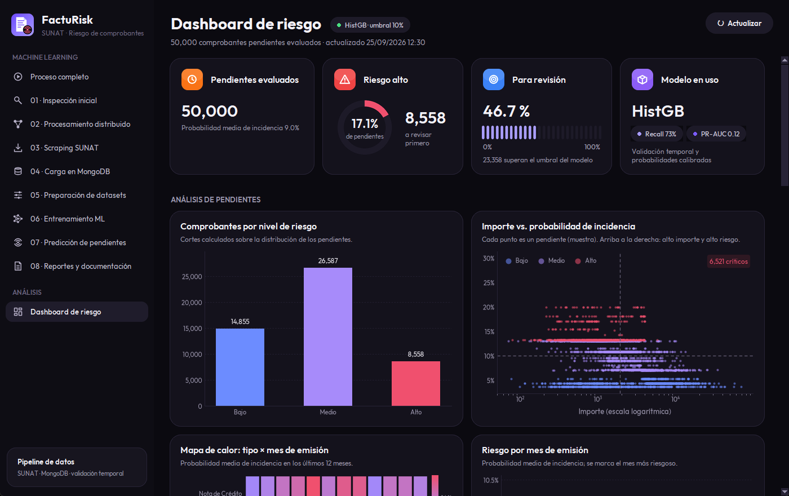
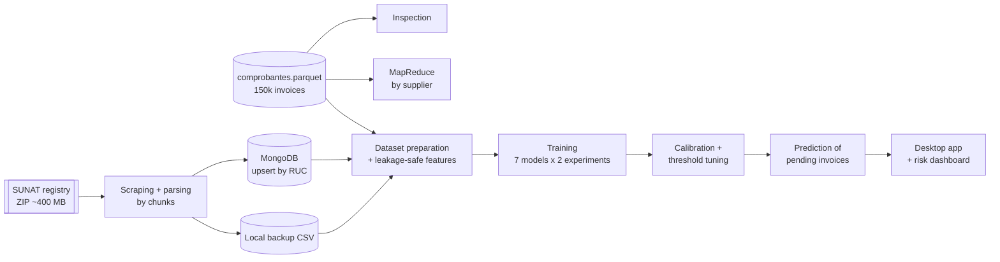
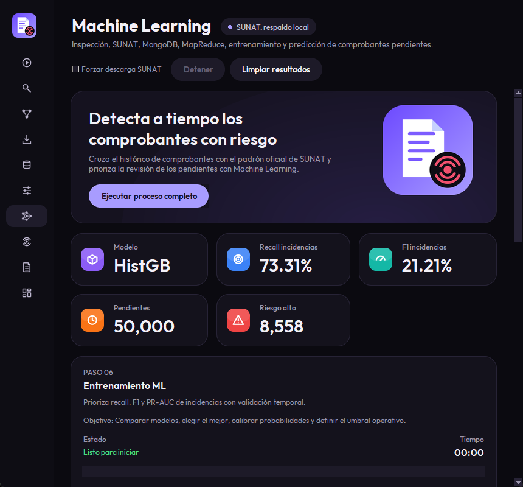
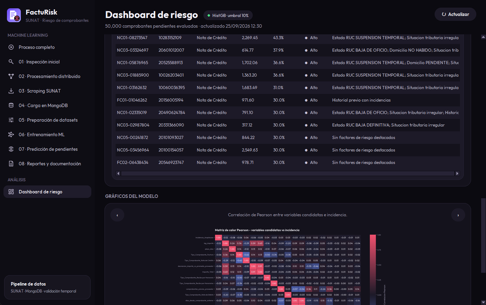

<p align="center">
  
</p>

<h1 align="center">FactuRisk SUNAT</h1>

<p align="center">
  <b>Machine learning pipeline that prioritizes the review of pending electronic invoices in Peru,<br>
  enriching invoice history with the official SUNAT taxpayer registry.</b>
</p>

<p align="center">
  <a href="https://github.com/Mianvarh/facturisk-sunat/actions/workflows/ci.yml"></a>
  
  
  
  
</p>

<p align="center">
  
</p>

## The problem

Companies that process electronic invoices receive thousands of documents that end up **accepted**, **observed** or **rejected**. Reviewing every pending invoice with the same priority wastes time. FactuRisk estimates the probability that a pending invoice ends with an incident, so reviewers can start with the riskiest ones.

> The model is a **prioritization aid**, not an automatic rejection system.

## What it does

1. **Inspects** 150,000 historical invoices: types, dates, RUC validity, nulls and duplicates.
2. **Processes the history MapReduce-style** in chunks (map → shuffle by RUC → reduce), mirroring how the job would run on Spark.
3. **Scrapes the official SUNAT reduced registry** (a ~400 MB ZIP), detecting encoding and delimiter automatically and streaming it in chunks to keep only the suppliers in the dataset.
4. **Loads the tax snapshot into MongoDB** with idempotent upserts and a unique RUC index, with a local backup when MongoDB is not available.
5. **Builds leakage-safe features**: supplier history (previous incidents, 30/90-day windows, amount deviation) computed only from earlier invoices.
6. **Trains and compares 7 models** (Logistic Regression, Random Forest, HistGradientBoosting, XGBoost, LightGBM, CatBoost, plus a baseline) **with and without SUNAT features**, using temporal validation, probability calibration and a threshold tuned for minimum recall.
7. **Predicts pending invoices**, assigns Low/Medium/High risk and explains the main factors of each prediction.
8. **Reports** metrics, charts and documentation, and shows everything in a **desktop app with an interactive risk dashboard**.

## Architecture



## Results

Evaluated on the most recent 20% of the invoices (chronological hold-out test set, 20,000 records):

| Metric | Value | Reading |
|---|---:|---|
| Selected model | HistGradientBoosting + SUNAT features | Best validation PR-AUC |
| PR-AUC | **0.122** | 1.4× the no-skill baseline (0.088 = incident rate) |
| Recall (incidents) | **73.3%** | Share of real incidents caught |
| Precision (incidents) | 12.4% | Flagged invoices that are real incidents |
| Invoices flagged for review | 50.2% | Review effort at the chosen threshold |

**Honest assessment:** the signal is real but **limited**. Reviewing the top half catches almost three out of four incidents, but precision is low, and the SUNAT features add only a small gain over supplier history alone. Those findings are documented rather than hidden. `outputs/comparacion_aporte_sunat.csv` quantifies the SUNAT contribution per model.

## Screenshots

| Machine learning module | Compact layout (860 px) |
|---|---|
|  |  |

<details>
<summary>Dashboard: priority table and risk factors</summary>


</details>

## Quick start

```bash
git clone https://github.com/Mianvarh/facturisk-sunat.git
cd facturisk-sunat
python -m venv .venv
.venv\Scripts\activate                     # Linux/macOS: source .venv/bin/activate
pip install -r requirements.txt            # optional: pip install -r requirements-optional.txt

python main.py gui                         # desktop app
python main.py todo                        # or run the whole pipeline from the terminal
python scripts/crear_acceso_directo.py     # Windows: desktop shortcut with the app icon
```

> On Windows, prefer the python.org installer over the Microsoft Store build: Store Python runs as a packaged app, so the taskbar always shows the Python logo instead of the FactuRisk icon.

The repository ships with everything needed to run **offline**: the invoice dataset and a SUNAT snapshot. Scraping the live registry and using MongoDB are optional:

```bash
docker compose up -d                       # local MongoDB
cp .env.example .env                       # point MONGODB_URI to it (or to MongoDB Atlas)
python main.py scraping                    # download the current SUNAT registry
python main.py mongodb                     # upsert suppliers into MongoDB
```

Each phase can also run on its own: `inspect`, `distribuido`, `scraping`, `mongodb`, `preparar`, `entrenar`, `predecir`, `documentar`.

## Key technical decisions

- **Temporal validation, not random splits.** Train, validation and test are chronological, so the model is always evaluated on invoices that come after the ones it learned from.
- **No target leakage.** Supplier-history features use only earlier invoices, and the smoothing prior uses only earlier days. Tests assert that neither the current nor any future outcome changes a row's features.
- **Recall-first threshold.** The threshold maximizes F1 among the thresholds that reach at least 60% recall, because a missed incident costs more than an extra review.
- **Calibrated probabilities.** Sigmoid and isotonic calibration are applied only when they improve the Brier score without hurting PR-AUC.
- **Graceful degradation.** MongoDB → local scraping backup → bundled snapshot, so the pipeline always runs.
- **Chunked I/O.** The SUNAT file (~1.5 GB uncompressed) is streamed in chunks and never loaded whole.

## Project structure

```
├── main.py                    # CLI and interactive menu; runs each phase as a subprocess
├── src/
│   ├── inspect_data.py        # 01 data quality report
│   ├── distributed_processing.py  # 02 MapReduce by chunks
│   ├── scrape_sunat.py        # 03 SUNAT registry download and parsing
│   ├── load_mongodb.py        # 04 MongoDB upsert
│   ├── prepare_dataset.py     # 05 merge + dataset split
│   ├── feature_engineering.py #    leakage-safe supplier history
│   ├── train_model.py         # 06 model comparison, calibration, threshold
│   ├── predict_pending.py     # 07 risk prediction and explanations
│   ├── generate_documentation_data.py  # 08 reports and docs
│   ├── gui_app.py             # desktop app (ML module)
│   ├── dashboard.py           # risk dashboard view
│   └── theme.py, ui_widgets.py, dashboard_data.py
├── data/raw/                  # comprobantes.parquet + SUNAT snapshot (tracked)
├── tests/                     # pytest suite (runs in CI)
├── scripts/                   # dataset conversion and asset generation
└── docs/                      # technical documentation (Spanish)
```

## About the data

This project started as an academic project for the Data Management course at **Universidad Autónoma del Perú**, using real invoice data from a Peruvian electronic-invoicing company. For this public version:

- the company name, supplier names and customer names were removed;
- the dataset was converted to Parquet with typed columns (`scripts/convertir_dataset.py`);
- the bundled SUNAT snapshot contains only tax status fields (no names or addresses). Running the scraping phase retrieves the full public registry locally.

## Documentation

Detailed documentation (in Spanish) is in [`docs/`](docs): architecture, data dictionary, full flow, results interpretation, installation and user manuals.

## Author

**Miguel Angel Vargas Hilario**, Systems Engineering student at Universidad Autónoma del Perú.
✉️ varhimiguel@gmail.com · [GitHub](https://github.com/Mianvarh)

The desktop interface redesign, visual identity and code audit were done with AI assistance.

## License

[MIT](LICENSE). The bundled [Outfit](https://github.com/Outfitio/Outfit-Fonts) typeface is licensed under the [SIL Open Font License 1.1](assets/fonts/OFL.txt).
