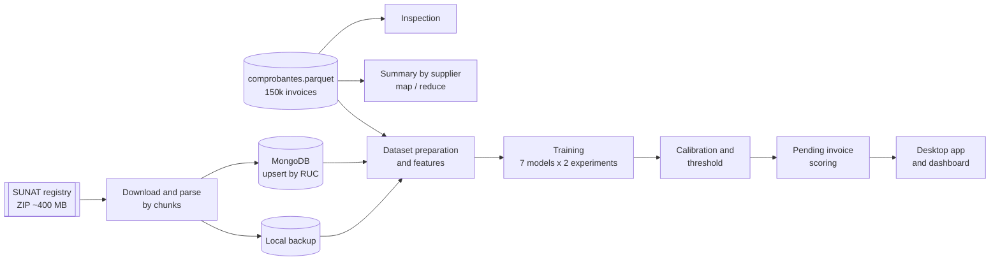
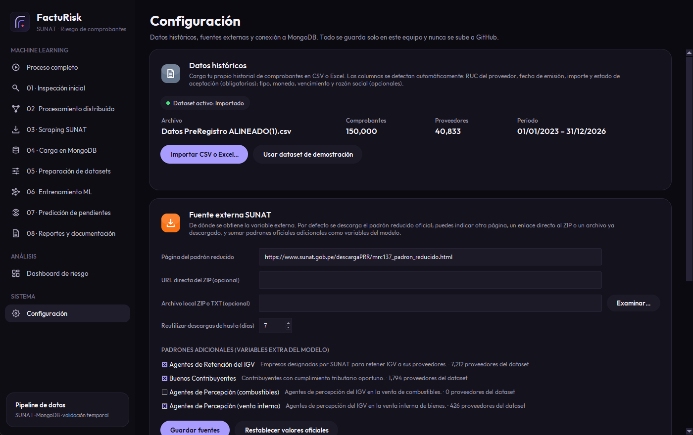

<p align="center">
  
</p>

<h1 align="center">FactuRisk SUNAT</h1>

<p align="center">
  Risk scoring for pending electronic invoices in Peru, combining invoice history with the SUNAT taxpayer registry.
</p>

<p align="center">
  <a href="https://github.com/Mianvarh/facturisk-sunat/actions/workflows/ci.yml"></a>
  
  
  
</p>

<p align="center">
  
</p>

## Overview

Electronic invoices sent to SUNAT end up accepted, observed or rejected. When there are thousands of pending invoices, reviewing all of them with the same priority is slow. FactuRisk estimates how likely each pending invoice is to end with an incident, so the review can start with the riskiest ones. It is meant to prioritize manual review, not to reject invoices automatically.

The pipeline:

1. Checks the quality of the invoice history (150,000 records): types, dates, RUC format, nulls and duplicates.
2. Summarizes the history per supplier in chunks, following a map / shuffle / reduce structure.
3. Downloads the SUNAT reduced registry (~400 MB ZIP), detects its encoding and delimiter, and streams it in chunks to keep only the suppliers in the dataset. Other SUNAT registries (retention agents, good taxpayers, perception agents) can be added as 0/1 features.
4. Stores the SUNAT data in MongoDB with upserts on a unique RUC index. If MongoDB is not available, it falls back to a local copy.
5. Builds supplier-history features (previous incidents, 30/90-day windows, deviation from the usual amount) using only earlier invoices.
6. Compares seven models with and without SUNAT features, using temporal validation, probability calibration and a threshold chosen for recall.
7. Scores the pending invoices, assigns a low / medium / high risk level and lists the main factors behind each score.
8. Generates reports and charts, and shows the results in a desktop app.

## Desktop app

- Import your own history from CSV or Excel. The delimiter, encoding and columns are detected automatically; the RUC column is identified by its content, so swapped headers still work.
- Change where the SUNAT data comes from (registry page, direct ZIP link or a local file) and choose which extra registries to use.
- Configure and test the MongoDB connection. Settings and imported data stay on your machine.
- Explore the predictions in an interactive dashboard: hover for details, click a chart to filter the priority table, search, export to CSV and open a detail sheet per invoice. With local data it shows company names and fiscal addresses; they can be hidden for screenshots.

## Architecture



## Results

Test set: the most recent 20% of the definitive invoices (20,000 records), kept out of training and validation.

| Metric | Value | Notes |
|---|---:|---|
| Model | XGBoost with SUNAT features | Best PR-AUC on validation |
| PR-AUC | 0.124 | Baseline (incident rate) is 0.088 |
| Recall | 66.1% | Incidents detected |
| Precision | 12.4% | Flagged invoices that were real incidents |
| Flagged for review | 45.1% | Share of pending invoices above the threshold |

The model finds two out of three incidents while reviewing less than half of the pending invoices, but precision is low, so it works as a way to order the review queue rather than as a classifier. The SUNAT status adds a small improvement over supplier history alone. The extra registries (retention agents, good taxpayers, perception agents) did not improve the model on this data; their permutation importance is close to zero. They remain available in the settings. `outputs/comparacion_aporte_sunat.csv` shows the contribution of the SUNAT features per model.

## Screenshots

| Machine learning module | Narrow window (860 px) |
|---|---|
|  |  |

<details>
<summary>Priority table (names hidden)</summary>


</details>

<details>
<summary>Settings</summary>


</details>

## Getting started

```bash
git clone https://github.com/Mianvarh/facturisk-sunat.git
cd facturisk-sunat
python -m venv .venv
.venv\Scripts\activate          # Linux/macOS: source .venv/bin/activate
pip install -r requirements.txt
pip install -r requirements-optional.txt   # XGBoost, LightGBM and CatBoost

python main.py gui               # desktop app
python main.py todo              # full pipeline from the terminal
python main.py                   # interactive menu
```

The repository includes the invoice dataset and a SUNAT snapshot, so it runs offline. To use live SUNAT data and MongoDB:

```bash
docker compose up -d             # local MongoDB (or use MongoDB Atlas)
python main.py scraping
python main.py mongodb
```

The MongoDB connection can be set in the app (Configuración) or in a `.env` file based on `.env.example`. On Windows, `python scripts/crear_acceso_directo.py` creates a desktop shortcut.

Tests:

```bash
python -m pytest
```

## Design decisions

- Train, validation and test sets are split by date, so every evaluation uses invoices that come after the training data.
- Supplier-history features only use earlier invoices, and the smoothing prior only uses earlier days. There are tests that check that neither the current outcome nor future outcomes change a row's features.
- The threshold maximizes F1 among the thresholds with at least 60% recall, since a missed incident costs more than an extra review.
- Calibration (sigmoid or isotonic) is kept only if it improves the Brier score without lowering PR-AUC.
- SUNAT data is read from MongoDB, then from the local backup, then from the bundled snapshot.
- The uncompressed SUNAT file (~1.5 GB) is read in chunks and never loaded at once.

## Project structure

```
├── main.py                        CLI and menu; runs each phase as a subprocess
├── src/
│   ├── inspect_data.py            data quality report
│   ├── distributed_processing.py  summary by supplier in chunks
│   ├── scrape_sunat.py            SUNAT reduced registry
│   ├── fuentes_externas.py        extra SUNAT registries
│   ├── load_mongodb.py            MongoDB upsert
│   ├── prepare_dataset.py         merge and dataset split
│   ├── feature_engineering.py     supplier-history features
│   ├── train_model.py             model comparison, calibration and threshold
│   ├── predict_pending.py         scoring of pending invoices
│   ├── importar_datos.py          CSV / Excel import
│   ├── gui_app.py                 desktop app
│   ├── dashboard.py               risk dashboard
│   └── settings_view.py           settings panel
├── data/raw/                      invoice dataset and SUNAT snapshots
├── tests/                         pytest suite (runs on every push)
├── scripts/                       dataset conversion, icons, desktop shortcut
└── docs/                          technical documentation (Spanish)
```

## About the data

I built the first version of this project for the Data Management course at Universidad Autónoma del Perú, with invoice data from a Peruvian e-invoicing company. In this public version the company, supplier and customer names were removed, the dataset was converted to Parquet (`scripts/convertir_dataset.py`), and the SUNAT snapshot only keeps tax status fields. Running the scraping phase downloads the full public registry locally.

## Author

Miguel Angel Vargas Hilario, Systems Engineering student at Universidad Autónoma del Perú.
varhimiguel@gmail.com · [GitHub](https://github.com/Mianvarh)

## License

[MIT](LICENSE). The bundled [Outfit](https://github.com/Outfitio/Outfit-Fonts) typeface is licensed under the [SIL Open Font License 1.1](assets/fonts/OFL.txt).
