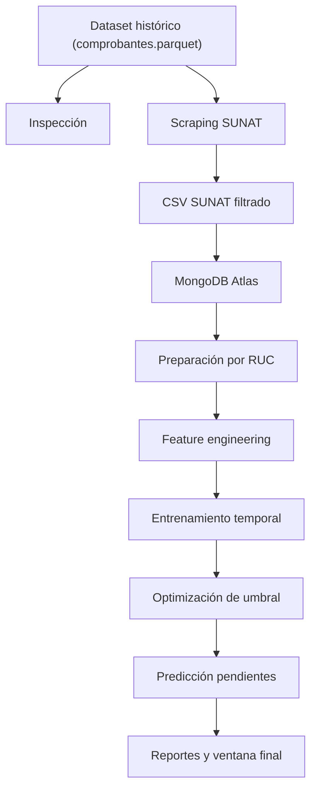
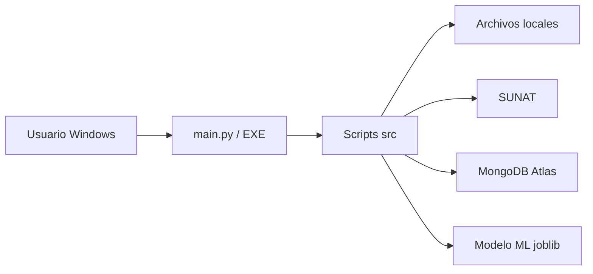
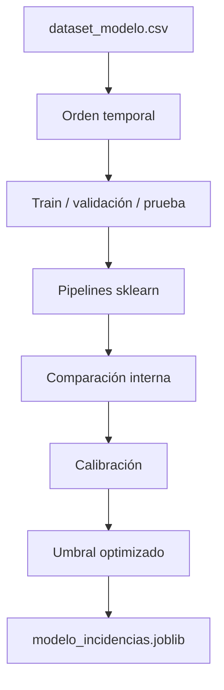
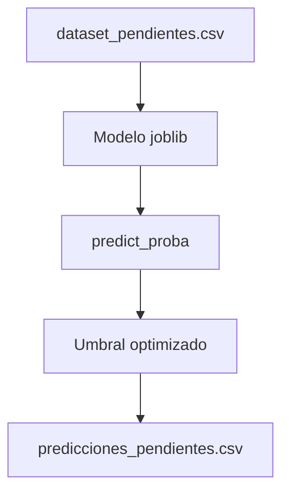
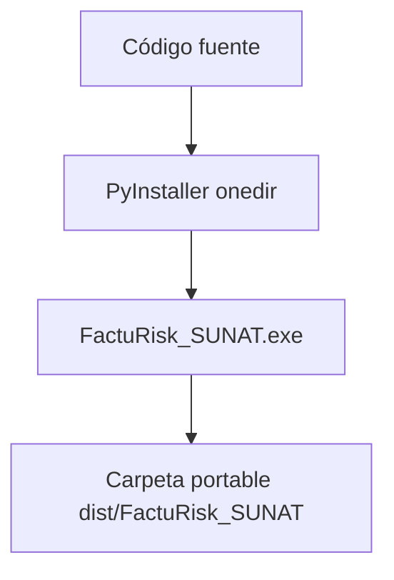

# Arquitectura del proyecto

## Flujo general

```mermaid
flowchart TD
  A["Dataset histórico (comprobantes.parquet)"] --> B["Inspección"]
  A --> C["Scraping SUNAT"]
  C --> D["CSV SUNAT filtrado"]
  D --> E["MongoDB Atlas"]
  E --> F["Preparación por RUC"]
  F --> G["Feature engineering"]
  G --> H["Entrenamiento temporal"]
  H --> I["Optimización de umbral"]
  I --> J["Predicción pendientes"]
  J --> K["Reportes y ventana final"]
```

## Componentes

```mermaid
flowchart LR
  U["Usuario Windows"] --> M["main.py / EXE"]
  M --> S["Scripts src"]
  S --> L["Archivos locales"]
  S --> N["SUNAT"]
  S --> DB["MongoDB Atlas"]
  S --> ML["Modelo ML joblib"]
```

## Entrenamiento

```mermaid
flowchart TD
  A["dataset_modelo.csv"] --> B["Orden temporal"]
  B --> C["Train / validación / prueba"]
  C --> D["Pipelines sklearn"]
  D --> E["Comparación interna"]
  E --> F["Calibración"]
  F --> G["Umbral optimizado"]
  G --> H["modelo_incidencias.joblib"]
```

## Predicción

```mermaid
flowchart TD
  A["dataset_pendientes.csv"] --> B["Modelo joblib"]
  B --> C["predict_proba"]
  C --> D["Umbral optimizado"]
  D --> E["predicciones_pendientes.csv"]
```

## Empaquetado portable

```mermaid
flowchart TD
  A["Código fuente"] --> B["PyInstaller onedir"]
  B --> C["FactuRisk_SUNAT.exe"]
  C --> D["Carpeta portable dist/FactuRisk_SUNAT"]
```
